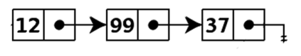

# Linked List

### Linked List

A linked list is a linear data structure similar to an array. However, unlike arrays, elements are not stored in a particular memory location or index. Instead, each element is a separate object that contains a pointer or link to the next object in that list.

Each element (commonly called nodes) contains two items: the stored data and a link to the next node. The data can be of any valid type. You can see this illustrated in the diagram below:

The entry point to a linked list is called the head. The head is a reference to the first node in the linked list. The last node in the list points to null. If a list is empty, the head is a null reference.

In JavaScript, a linked list looks like this:

```javascript
const list = {
  head: {
    value: 6,
    next: {
      value: 10,
      next: {
        value: 12,
        next: {
          value: 3,
          next: null
        }
      }
    }
  }
};
```

#### Advantages of Linked Lists:

Nodes can be easily removed or added to a linked list without reorganizing the entire data structure. This is an advantage over arrays.

#### Disadvantages of Linked Lists:

Search operations are slow in linked lists. Unlike arrays, random access to data elements is not allowed. Nodes are accessed sequentially starting from the first node.

Memory usage is higher than arrays due to the storage of pointers.

#### Types of Linked Lists

There are three types of linked lists:

* **Singly Linked Lists:** Each node contains only one pointer to the next node. This is what we have been talking about so far.

<figure><figcaption></figcaption></figure>

* **Doubly Linked Lists:** Each node contains two pointers; one to the next node and another to the previous node.

<figure><figcaption></figcaption></figure>

* **Circular Linked Lists:** A variation of the linked list where the last node points to the first node or another node before it, thus forming a loop.

<figure><figcaption></figcaption></figure>

#### Implementation of a List Node in JavaScript

As mentioned earlier, a list node contains two items, the data and the pointer to the next node. We can implement a list node in JavaScript as follows:

```javascript
class ListNode {
  constructor(data) {
    this.data = data;
    this.next = null;
  }
}
```

#### Implementation of a Linked List in JavaScript

**LinkedList Class**

A class representing a linked list, this class will have the property head which will represent the initial node. At the beginning, the head will be set to null as there won't be any associated node initially.

```javascript
class LinkedList {
  constructor() {
    this.head = null;
  }
}
```

**Node Class**

A class representing a node, it will have two properties, the value property representing the data of interest to be stored, and the next property representing a pointer to the next element in the list.

```javascript
class Node {
  constructor(value, next) {
    this.value = value;
    this.next = next;
  }
}
```

The following steps will add methods to the LinkedList class to help us manipulate nodes in our list, such as inserting, searching, and deleting elements.

**Node Insertion Method**

**Node Insertion Method**

We will start with a basic method for inserting nodes into our linked list.

```javascript
insertNode(value) {
  const newNode = new Node(value, null);
  if (this.head === null) {
    this.head = newNode;
  } else {
    let current = this.head;
    while (current.next) {
      current = current.next;
    }
    current.next = newNode;
  }
}
```

In the previous code snippet:

* A new node is created with the specified value.
* The first node is stored in the head property.
* Subsequent nodes are linked to the next property of the last element and so on.

**NOTE:** The last element of the list can be distinguished with the next property, which will have the value null.

**Node Print Method**

We will continue with a basic method to print the value of each node to the console.

```javascript
print() {
  let current = this.head;
  while (current) {
    console.log(current.value);
    current = current.next;
  }
}
```

In the previous code snippet:

* We traverse the list element by element, printing the value property.

**Node Search Method**

We will continue with a basic method to search for elements based on their value. This time we will return the first match.

```javascript
findNode(value) {
  let current = this.head;
  while (current) {
    if (current.value === value) {
      return current;
    }
    current = current.next;
  }
  return null;
}
```

In the previous code snippet:

* We use the same element traversal technique with the while loop, but add a conditional to compare the values.
* If the value matches the one we are looking for, the element is returned.
* If the value doesn't match, we continue traversing the list.
* If no element is found, null is returned.

**Node Deletion Method**

We will continue with a basic method for deleting elements based on their value.

```javascript
deleteNode(value) {
  if (this.head.value === value) {
    this.head = this.head.next;
  } else {
    let current = this.head;
    while (current.next) {
      if (current.next.value === value) {
        current.next = current.next.next;
        return;
      }
      current = current.next;
    }
  }
}
```

In the previous code snippet:

* We traverse the list elements until the node with the value is found.
* If the node is found, we skip the element, connecting to the next one, completely removing the current reference.

**Complete Code**

```javascript
class Node {
  constructor(value, next) {
    this.value = value;
    this.next = next;
  }
}

class LinkedList {
  constructor() {
    this.head = null;
  }

  insertNode(value) {
    const newNode = new Node(value, null);
    if (this.head === null) {
      this.head = newNode;
    } else {
      let current = this.head;
      while (current.next) {
        current = current.next;
      }
      current.next = newNode;
    }
  }

  print() {
    let current = this.head;
    while (current) {
      console.log(current.value);
      current = current.next;
    }
  }

  deleteNode(value) {
    if (this.head.value === value) {
      this.head = this.head.next;
    } else {
      let current = this.head;
      while (current.next) {
        if (current.next.value === value) {
          current.next = current.next.next;
          return;
        }
        current = current.next;
      }
    }
  }

  findNode(value) {
    let current = this.head;
    while (current) {
      if (current.value === value) {
        return current;
      }
      current = current.next;
    }
    return null;
  }
}

const linkedList = new LinkedList();
linkedList.insertNode(12);
linkedList.insertNode(99);
linkedList.insertNode(37);
linkedList.print();
console.log(linkedList.findNode(37));
```
